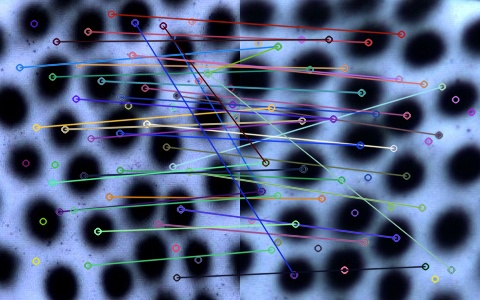
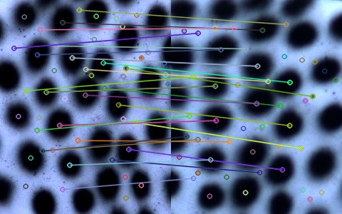

# The Repo of the SIFT-based LSTM algorihtm 

### Improved Coarse-to-Fine Matching Algorithm

This is the matching algorithm developed in the paper: [Wireless Binocular Stereo Vision Measurement System Based on Improved Coarse-to-fine Matching Algorithm](https://www.hindawi.com/journals/schm/2023/1132569/). The main code can be found in LSTM/LSM_GN_final.cpp

#### SIFT Matching results
 

#### Improved coarse-to-fine mathcing results
 

We choose to open our ariticle and please cite the related paper if you use this repo.
<section class="section" id="Citation">
  

    <h2 class="title">Citation</h2>
    <pre><code>Cheng Wang, Teng Xiao, Zhiqun Gong, Shiting Yang, Dongliang Zhang, Fei Deng, "Wireless Binocular Stereovision Measurement System Based on Improved Coarse-to-Fine Matching Algorithm", Structural Control and Health Monitoring, vol. 2023, Article ID 1132569, 19 pages, 2023. https://doi.org/10.1155/2023/1132569
</code></pre>
  

</section>